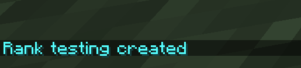
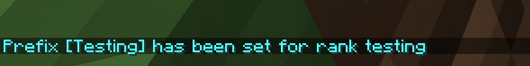

# Creating a Rank

## In-Game

To create a basic rank ingame you run `rank create {name}` where `{name}` is replaced with its name (without formatting)

`rank create testing`

To change how this change's name is displayed in chat, such as its prefix or suffix you run `rank {name} {prefix or suffix} <your display name here>` where

 - `{name}` is replaced with the rank name you created in the previous step.

- `{prefix or suffix}` is replaced with one of the two, such as `prefix` or `suffix`

- `<your display name here>` is replaced with how you want the name to be displayed, you can use `&` instead of `§` for [color codes](https://minecraft.fandom.com/wiki/Formatting_codes)

`/rank testing prefix &b[Testing]`
