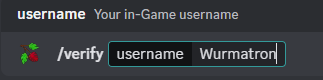
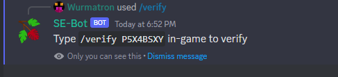
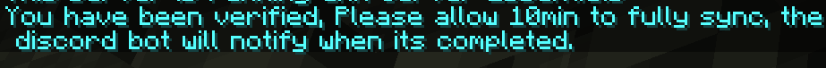

# Discord Bot

### Features

- Discord Account Verification
- In-Game Server Chat Bridge
- Self-Service Commands

### Commands

- Delete Player File
- Send To Spawn

## How To Verify Discord Account

1. On the discord server run `/verify <username>` where `<username>` is your username (case specific)

2. On one of the networked servers run the provided command `/verify <code>` where the code is the code generated by the bot.

3. After a bit the discord bot will notify you along with providing any rewards / ranks the server owner has set to be given upon verification.

