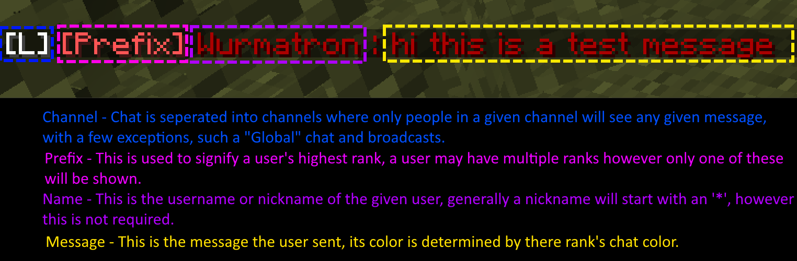

# Getting Started

So you are playing on a server running Server Essentials. This guide will help you get accused to how certain things work, although if you have played on a plugin based server before some of these things may be the same or similar.
Server Essentials is a mod that is designed to be used to fully control the server without the need of plugins or other mods. Server Essentials runs on a Module system that allow for the server owner to control what features the server will have / use. Such as having an economy extra security features or even having certain commands. Its highly configurable to allow for server owners to make a customized experience that can fit better into any given modpack.

## Chat

## Ranks
You may have multiple ranks, however only one of them will be displayed. You do gain all the permissions of all your ranks however.
Depending on the server, you may have rankup's enabled that allow you to rankup once you meet certain conditions, these can be checked though the command `/ar check`

## Modules
To check a given servers module you can run `/se modules` while the command is safe for server owners to have permissions to run, some will choose to have this forbidden.

## Useful commands

- `/spawn`
- `/sethome`  `/home` `/back`
- `/tpa` `/tpaccept` `/tpdeny` `/tplock`
- `/balance` `/pay`
- `/help`
- `/channel`
- `/lang`
